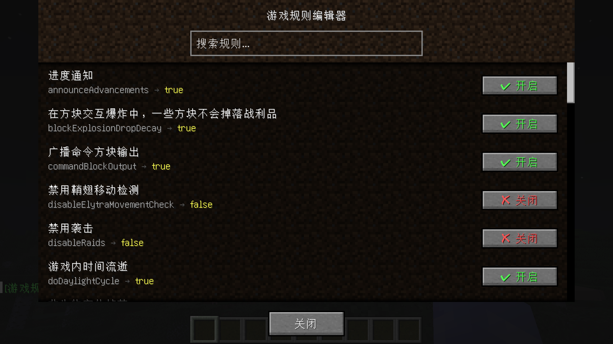

# Gamerule GUI Mod

一个 Fabric 模组，通过 `/gamerule-gui` 命令打开图形界面，可视化查看和修改所有游戏规则（gamerule）。

## 功能

- **图形化界面**：输入 `/gamerule-gui` 打开规则编辑器，无需记忆命令
- **可视化开关**：Boolean 型规则以按钮显示，点击切换 true/false
- **数字输入**：Integer 型规则显示为输入框，支持负数
- **实时搜索**：支持英文规则名和中文翻译名搜索
- **多语言**：界面和聊天消息自动跟随 Minecraft 语言（中/英）
- **无权限门槛**：任何人都可以打开 GUI 查看规则，修改需要 OP 权限
- **Mod Menu 集成**：配置页面入口，点击跳转规则编辑器
- **showlog 控制**：`/gamerule-gui showlog false` 关闭操作聊天输出

## 命令

| 命令 | 说明 |
|------|------|
| `/gamerule-gui` | 打开游戏规则编辑器 |
| `/gamerule-gui showlog <true/false>` | 控制操作反馈的聊天输出 |

## 截图



## 环境要求

- Minecraft **1.20.1**
- Fabric Loader **>=0.14.24**
- Fabric API（推荐）

## 安装

1. 安装 Fabric Loader
2. 把 `gamerule-gui-1.0.0.jar` 放入 `.minecraft/mods/` 文件夹
3. 启动游戏

## 构建

```bash
git clone https://github.com/Gaobai-awa/gamerule-gui.git
cd gamerule-gui
./gradlew build
```

构建产物在 `build/libs/` 目录下。

## 许可证

[MIT](LICENSE)

## 作者

- **Gaobaiawa**
- **DeepSeek V4-Flash** — AI 辅助创作
